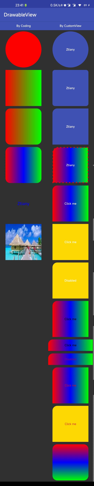

# Lib Shape/Drawable View

An android library for developers to avoid writing drawable XML files.

That would be very convenient if we can define various drawables by view's attributes. And that is
what this library can do.

## 1 Lib ShapeView

The Lib-ShapeView harnesses the ability
of [MaterialShapeDrawable](https://developer.android.com/reference/com/google/android/material/shape/MaterialShapeDrawable)

We can use views in Lib-ShapeView to define their background directly by attributes like the picture
below shown.


code snippet:

```xml
<com.android.base.ui.shape.ShapeableTextView
style="@style/StyleShapeView"
android:layout_width="match_parent"
android:layout_height="70dp"
android:layout_margin="10dp"
android:clickable="true"
android:gravity="center"
android:padding="2dp"
android:text="Click me!"
android:textColor="@color/color_state_test1"
android:textStyle="bold"
app:msd_backgroundColor="@color/color_state_test2"
app:msd_strokeColor="@color/color_state_test1"
app:msd_strokeWidth="4dp"
app:shapeAppearance="@style/ShapeAppearance.Hexagon" />
```

## 2 Lib DrawableView

But if we need a gradient drawable as a view's background. We then need views in The
Lib-DrawableView.



code snippet:

```xml
<com.android.base.ui.drawable.DTextView
android:layout_width="150dp"
android:layout_height="150dp"
android:layout_margin="5dp"
android:gravity="center"
android:text="Ztiany"
android:textColor="@color/white"
android:textStyle="bold"
app:cdv_drawable_type="gradient"
app:cgd_shape="rectangle"
app:cgd_shape_corner_style="@style/CornerAppearance.Rounded10"
app:cgd_shape_solid="@color/colorPrimary" />

<com.android.base.ui.drawable.DTextView
android:layout_width="150dp"
android:layout_height="150dp"
android:layout_margin="5dp"
android:gravity="center"
android:text="Ztiany"
android:textColor="@color/white"
android:textStyle="bold"
app:cdv_drawable_type="gradient"
app:cgd_shape="rectangle"
app:cgd_shape_corner_style="@style/StyleGradientDrawableView_Round_TL20"
app:cgd_shape_solid="@color/colorPrimary" />
```

Acknowledgment: The core code of Lib DrawableView is copied from [又一个减少冗余 Drawable 资源的解决方案](https://mp.weixin.qq.com/s/qxMoI7UTw3WtiRR6oIDGKA)。

## 3  Installation

```groovy
implementation 'io.github.ztiany:android-drawable-view:1.2.2'
```
